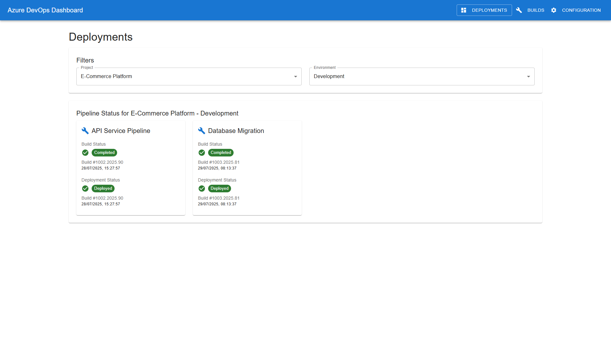
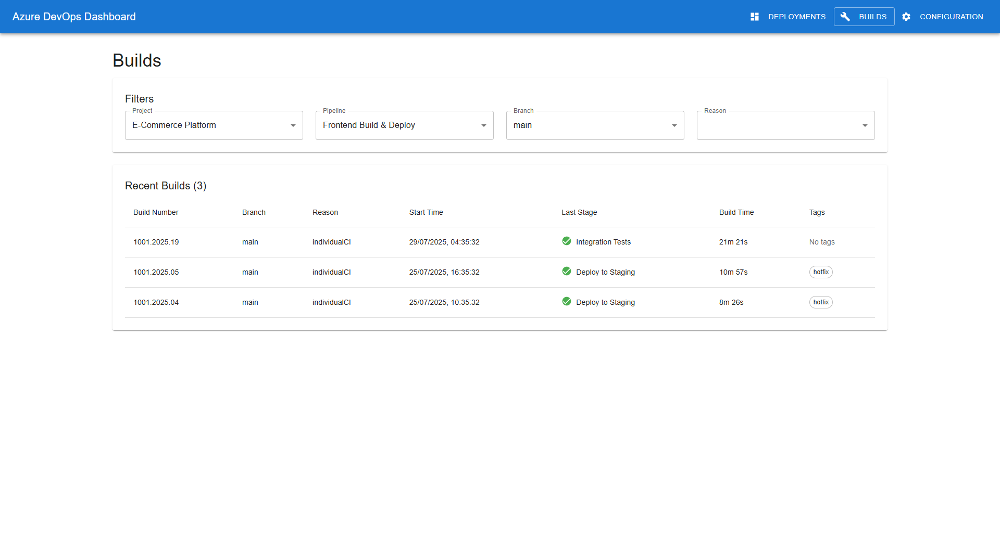
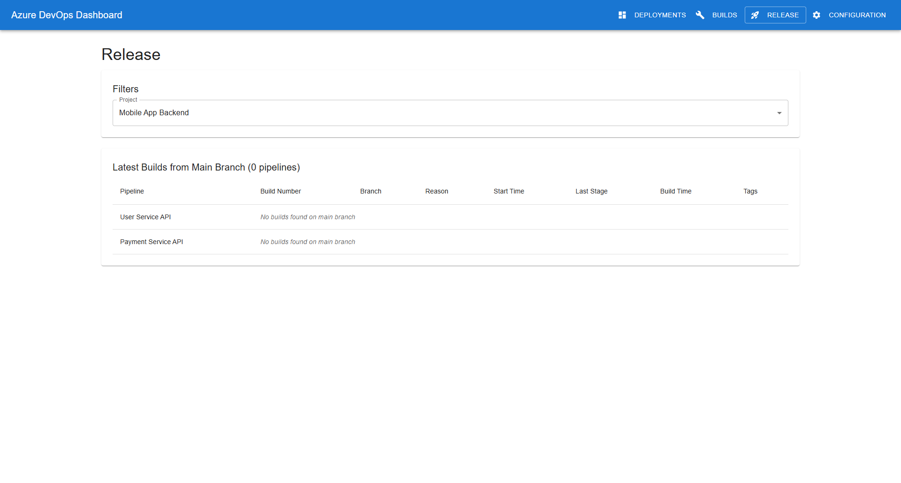
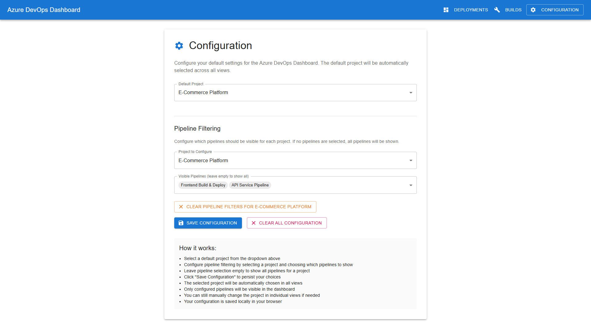

# Azure DevOps Dashboard

Azure DevOps Dashboard is a modern web application for visualizing and monitoring Azure DevOps pipelines, builds, and deployments. It provides a unified view of your DevOps activity, making it easy to track build health, deployment status, project configuration, and **Jira ticket integration**. The application features a clean, Material-UI based interface with real-time data updates and comprehensive filtering capabilities.

## Key Features

- **🔄 Real-time Pipeline Monitoring**: Live updates of build and deployment status
- **🏷️ Jira Integration**: Automatic detection and linking of Jira tickets from build tags
- **📊 Multi-view Dashboard**: Four specialized views for different monitoring needs
- **🎯 Smart Filtering**: Filter builds by project, branch, status, and more
- **🎨 Modern UI**: Clean Material-UI interface with responsive design
- **⚡ Performance Optimized**: Shared components and efficient data loading
- **🧪 Comprehensive Testing**: Unit tests, integration tests, and E2E tests

---


## UI Overview

The dashboard features four main views, accessible from the navigation bar:

### 1. Deployments View
- **Purpose:** See the latest deployment status for each pipeline and environment.
- **Features:** Color-coded status, quick links to build results, and deployment history.



### 2. Builds View
- **Purpose:** Browse recent builds for all pipelines, filter by project, branch, or status.
- **Features:** Build numbers, status, timestamps, direct links to Azure DevOps, and **Jira ticket integration**.
- **Jira Integration:** 
  - Automatically detects Jira ticket references in build tags (e.g., "Xen-123", "XEN-456")
  - Displays clickable Jira status badges that link directly to tickets
  - Shows ticket status (To Do, In Progress, In Review, Done) with color coding



### 3. Release View
- **Purpose:** See the latest build for each pipeline on the main branch, focused on release candidates (Individual CI builds).
- **Features:** Shows the most recent qualifying build per pipeline, with build details, branch, reason, direct links to Azure DevOps, and **Jira ticket integration**.
- **Enhanced Display:** Pipeline name prominently displayed for easy identification across projects.



### 4. Configuration View
- **Purpose:** Select which projects and pipelines appear in your dashboard.
- **Features:** Enable/disable projects and pipelines, filter by environment, and save preferences locally.



---

## Getting Started


### Prerequisites

- Node.js 18+
- npm or yarn
- (Optional) .NET 6+ SDK for running the API backend

#### API Setup: Azure DevOps PAT Token

To connect the backend API to your Azure DevOps organization, you need a Personal Access Token (PAT) with appropriate permissions.

1. Go to Azure DevOps > User Settings > Personal Access Tokens.
2. Create a new token with at least "Read & execute" permissions for Builds, Pipelines, and Projects.
3. Copy your PAT and update the following fields in `api/AzDevOpsApi/appsettings.Development.json`:

```json
  "AzureDevOps": {
    "Organization": "YOUR_ORG_NAME",
    "PAT": "YOUR_PERSONAL_ACCESS_TOKEN"
  }
```

**Never commit real PAT tokens to source control.**
For production, use environment variables or a secure secrets store.

#### Optional: Jira Integration Setup

To enable Jira ticket integration features:

1. Configure your Jira base URL and authentication in the API settings.
2. The system automatically detects Jira ticket references in build tags (supports formats like "XEN-123", "xen-456").
3. **Set up MCP Server for Jira**: Configure the Model Context Protocol (MCP) server to enable seamless Jira API integration:
   - Install and configure the MCP Jira server component
   - Set up authentication credentials for Jira API access
   - Configure the server endpoint in your API settings
   - Ensure proper network connectivity between the API and Jira instance
4. Build tables will display clickable Jira status badges linking directly to tickets.

*Note: Jira integration is optional. The dashboard works fully without it, using mock data for demonstration.*

### Ways to Run the UI and API

#### 1. Using npm/yarn (local development)

- **Start the client (mock API):**
  ```bash
  npm install
  npm start
  ```
  The UI will use mock data (no backend required).

- **Start the client (real API):**
  ```bash
  REACT_APP_API_URL=http://localhost:5031/api npm start
  ```
  The UI will connect to your running API backend.

- **Start the API backend:**
  ```bash
  cd ../api/AzDevOpsApi
  dotnet run
  ```

#### 2. Using Visual Studio Code Tasks

This project includes pre-configured VS Code tasks for easy development:

- Open the Command Palette (`Ctrl+Shift+P` or `F1`).
- Select `Tasks: Run Task`.
- Choose from available tasks:
  - **`Start client (mock API)`** - Runs the UI with mock data (no backend required)
  - **`Start client (real API)`** - Runs the UI connected to the backend API
  - **`Start API`** - Runs the .NET backend server
  - **`Run Playwright Tests`** - Executes E2E smoke tests
  - **`Build client with tests`** - Builds the client and runs all tests
  - **`Build and Test API`** - Builds and tests the backend API

*Tasks can run in the background, allowing you to start multiple services simultaneously.*

#### 3. Using Docker

- **Start everything with Docker Compose:**
  ```bash
  docker-compose up --build
  ```
  This will build and run both the client and API in containers.

---

## Project Structure

```
client/
 ├── public/                # Static files and screenshots
 ├── src/
 │   ├── components/        # Reusable UI components
 │   │   ├── views/         # Main application views
 │   │   │   ├── BuildsView.tsx      # Builds listing page
 │   │   │   ├── ReleaseView.tsx     # Release candidates page
 │   │   │   ├── Dashboard.tsx       # Deployments overview
 │   │   │   └── Configuration.tsx   # Settings page
 │   │   ├── BuildsTable.tsx         # Shared builds table
 │   │   ├── BuildFilters.tsx        # Filtering controls
 │   │   ├── JiraStatus.tsx          # Jira integration component
 │   │   └── Navigation.tsx          # App navigation
 │   ├── hooks/             # Custom React hooks
 │   │   ├── useBuilds.ts            # Shared builds data logic
 │   │   └── useJira.ts              # Jira integration logic
 │   ├── utils/             # Utility functions
 │   │   ├── buildUtils.ts           # Build data processing
 │   │   └── jiraUtils.ts            # Jira tag parsing
 │   ├── models/            # TypeScript interfaces
 │   ├── services/          # API services (real + mock)
 │   ├── App.tsx            # Main application component
 │   └── index.tsx          # Entry point
 ├── package.json           # Dependencies and scripts
 └── tsconfig.json          # TypeScript configuration
api/
 └── AzDevOpsApi/           # .NET backend with Jira integration
     ├── Controllers/       # API endpoints
     ├── Services/          # Business logic and external API calls
     └── Models/            # Data models and DTOs
```

### Architecture Highlights

- **Shared Components**: Reusable UI components eliminate code duplication
- **Custom Hooks**: `useBuilds` and `useJira` provide centralized data management
- **View Organization**: Main pages organized in `components/views/` for clarity
- **Type Safety**: Comprehensive TypeScript interfaces throughout
- **Modular Design**: Clear separation between views, components, and utilities

---

## Recent Updates & Improvements

### 🎯 Latest Features (2025)

- **Jira Integration**: 
  - Automatic detection of Jira ticket references in build tags
  - Support for various formats: "XEN-123", "xen-456", "Xen-789"
  - Clickable status badges linking directly to Jira tickets
  - Real-time ticket status display with color coding

- **Enhanced UI/UX**:
  - Improved column layout with Tags and Jira Status positioning
  - Clickable Jira status elements for better user interaction
  - Enhanced build table with pipeline name display in Release View
  - Consistent filtering and sorting across all views

- **Code Architecture Improvements**:
  - **Eliminated Code Duplication**: Refactored BuildsView and ReleaseView to use shared components
  - **Created Shared Components**: BuildsTable, BuildFilters, and utility functions
  - **Custom Hooks**: useBuilds hook for centralized data management
  - **Better Organization**: Moved all main views to `components/views/` folder
  - **Type Safety**: Enhanced TypeScript interfaces for better development experience

- **Performance & Maintainability**:
  - Reduced component code from ~550 lines to ~50 lines through shared architecture
  - Centralized build data processing and filtering logic
  - Improved test coverage with updated component structure
  - Enhanced error handling and loading states

---

## Testing

This project includes comprehensive testing at multiple levels to ensure reliability and maintainability:

### 1. .NET API Tests

Run all backend (API) tests using the .NET CLI:

```bash
cd api/AzDevOpsApi
dotnet test
```
This will build and run all unit and integration tests for the API, including Jira integration endpoints.

### 2. React Unit/Component Tests

Run all React (frontend) tests using:

```bash
npm test
```
This launches the test runner in interactive watch mode for all React unit and component tests, including:
- Component rendering tests
- Jira utility function tests (`jiraUtils.test.ts`)
- Shared component tests
- Hook tests

### 3. Playwright End-to-End Tests

Run Playwright E2E tests for the UI:

```bash
npm run test:e2e
```
For smoke tests (faster, good for CI/local dev):
```bash
npm run test:e2e:smoke
```
For UI mode (visual debugging):
```bash
npm run test:e2e:ui
```
Playwright tests simulate real user interactions and verify the app end-to-end, including:
- Navigation between views
- Build filtering and sorting
- Jira integration display
- Configuration management

### Test Coverage

- **Backend**: Controllers, services, and data models
- **Frontend**: Components, hooks, utilities, and integration flows  
- **E2E**: Complete user workflows across all four main views
- **Mock Data**: Comprehensive mock services for testing without external dependencies

---

## Deployment to Azure

This application includes automated deployment scripts for Azure App Service. The deployment uses Azure Bicep for infrastructure as code and PowerShell scripts for orchestration.

### Prerequisites

Before deploying, ensure you have:

- **Azure CLI** installed and configured
- **Node.js** (v18+) and npm installed  
- **Azure subscription** with appropriate permissions
- **Azure DevOps PAT token** (for the API configuration)

### Quick Deployment

1. **Login to Azure:**
   ```powershell
   az login
   ```

2. **Test prerequisites:**
   ```powershell
   cd deploy
   .\test-deployment.ps1
   ```

3. **Deploy the application:**
   ```powershell
   .\redeploy.ps1
   ```

### Deployment Architecture

The deployment creates the following Azure resources:

- **Resource Group**: Container for all resources
- **App Service Plan**: Linux-based hosting plan (B1 SKU by default)
- **App Service**: Hosts the React frontend with Node.js runtime
- **Application Insights**: Application monitoring and logging
- **Log Analytics Workspace**: Centralized logging

### Deployment Scripts

#### `test-deployment.ps1`
Validates all prerequisites before deployment:
- Azure CLI installation and authentication
- Node.js and npm availability
- Project structure validation

#### `redeploy.ps1` - Main Deployment Script
Orchestrates the full deployment process with options:

```powershell
# Basic deployment
.\redeploy.ps1

# Deploy with custom API URL
.\redeploy.ps1 -ApiUrl "https://your-api.azurewebsites.net/api"

# Skip infrastructure (web app only)
.\redeploy.ps1 -SkipInfrastructure

# Force complete redeployment
.\redeploy.ps1 -Force

# Deploy to different environment
.\redeploy.ps1 -Environment "staging"
```

#### `deploy.ps1` - Infrastructure Deployment
Uses Bicep templates to create Azure infrastructure:
- Creates resource groups
- Deploys App Service and related resources
- Configures application settings

#### `deploy-web.ps1` - Application Deployment
Builds and deploys the React application:
- Installs npm dependencies
- Builds production React app
- Creates deployment package with Node.js server
- Deploys to Azure App Service

### Configuration Files

#### `main.bicep` - Infrastructure Template
Defines all Azure resources with parameterized configuration:

```bicep
// Key parameters
param apiUrl string              // External API endpoint
param environment string        // dev/staging/prod
param appServicePlanSku string  // Azure pricing tier
param location string           // Azure region
```

#### `parameters.json` - Default Configuration
Provides default values for Bicep parameters:

```json
{
  "parameters": {
    "resourcePrefix": { "value": "azdevops-dashboard" },
    "location": { "value": "UK South" },
    "apiUrl": { "value": "https://your-external-api-url.com/api" },
    "environment": { "value": "dev" },
    "appServicePlanSku": { "value": "B1" }
  }
}
```

### Environment-Specific Deployments

Create separate parameter files for different environments:

```powershell
# Create parameters.prod.json with production settings
.\redeploy.ps1 -Environment "prod" -ApiUrl "https://prod-api.yourdomain.com/api"
```

### Post-Deployment Configuration

After deployment, configure your application:

1. **Update API URL** (if needed):
   ```powershell
   az webapp config appsettings set \
     --resource-group rg-azdevops-dashboard-dev-uks \
     --name your-webapp-name \
     --settings REACT_APP_API_URL='https://your-api.com/api'
   ```

2. **View application logs:**
   ```powershell
   az webapp log tail \
     --resource-group rg-azdevops-dashboard-dev-uks \
     --name your-webapp-name
   ```

3. **Restart application:**
   ```powershell
   az webapp restart \
     --resource-group rg-azdevops-dashboard-dev-uks \
     --name your-webapp-name
   ```

### Deployment Output

Successful deployment provides:
- **Web App URL**: Direct link to your deployed application
- **Resource names**: Generated Azure resource identifiers
- **Useful commands**: Copy-paste commands for management

### Troubleshooting

Common deployment issues and solutions:

- **"waiting for content"**: Usually resolved by redeploying the web application
- **Module not found errors**: Ensure all dependencies are properly installed
- **Authentication issues**: Verify Azure CLI login and permissions
- **Build failures**: Check Node.js version compatibility (requires v18+)

For detailed logs and debugging:
```powershell
# Enable detailed logging
az webapp log config --application-logging filesystem --level information

# View real-time logs
az webapp log tail --provider filesystem
```

---