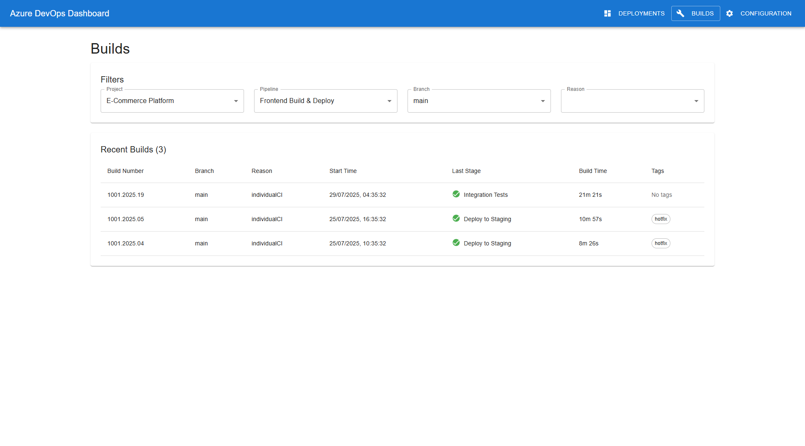

# Azure DevOps Dashboard

Azure DevOps Dashboard is a modern web application for visualizing and monitoring Azure DevOps pipelines, builds, and deployments. It provides a unified view of your DevOps activity, making it easy to track build health, deployment status, and project configuration.

---

## UI Overview

The dashboard features three main views, accessible from the navigation bar:

### 1. Deployments View
- **Purpose:** See the latest deployment status for each pipeline and environment.
- **Features:** Color-coded status, quick links to build results, and deployment history.


### 2. Builds View
- **Purpose:** Browse recent builds for all pipelines, filter by project, branch, or status.
- **Features:** Build numbers, status, timestamps, and direct links to Azure DevOps.



### 3. Configuration View
- **Purpose:** Select which projects and pipelines appear in your dashboard.
- **Features:** Enable/disable projects and pipelines, filter by environment, and save preferences locally.


---

## Getting Started

### Prerequisites

- Node.js 18+
- npm or yarn
- (Optional) .NET 6+ SDK for running the API backend

### Ways to Run the UI and API

#### 1. Using npm/yarn (local development)

- **Start the client (mock API):**
  ```bash
  npm install
  npm start
  ```
  The UI will use mock data (no backend required).

- **Start the client (real API):**
  ```bash
  REACT_APP_API_URL=http://localhost:5031/api npm start
  ```
  The UI will connect to your running API backend.

- **Start the API backend:**
  ```bash
  cd ../api/AzDevOpsApi
  dotnet run
  ```

#### 2. Using Visual Studio Code Tasks

- Open the Command Palette (`Ctrl+Shift+P` or `F1`).
- Select `Tasks: Run Task`.
- Choose:
  - `Start client (mock API)` for mock mode.
  - `Start client (real API)` to connect to the backend.
  - `Start API` to run the backend.

#### 3. Using Docker

- **Start everything with Docker Compose:**
  ```bash
  docker-compose up --build
  ```
  This will build and run both the client and API in containers.

---

## Project Structure

```
client/
 ├── public/                # Static files (add screenshots here)
 ├── src/
 │   ├── components/        # UI components
 │   ├── models/            # TypeScript interfaces
 │   ├── services/          # API services
 │   ├── App.tsx            # Main application component
 │   └── index.tsx          # Entry point
 ├── package.json           # Dependencies and scripts
 └── tsconfig.json          # TypeScript configuration
api/
 └── AzDevOpsApi/           # .NET backend
```

---

## Learn More

- [React Documentation](https://reactjs.org/)
- [TypeScript Documentation](https://www.typescriptlang.org/)
- [Material-UI Documentation](https://mui.com/)
- [Azure DevOps REST API](https://learn.microsoft.com/en-us/rest/api/azure/devops/)

---